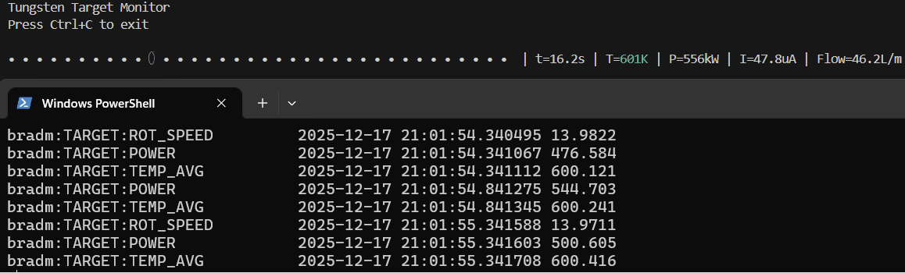

# Tungsten Target

Mock control of tungsten target with visualization

## Setup

1. Install uv with PowerShell: `powershell -ExecutionPolicy ByPass -c "irm https://astral.sh/uv/install.ps1 | iex"`
1. `uv sync`

## Usage

1. `uv run main.py`
1. monitor example: `camonitor bradm:TARGET:TEMP_AVG bradm:TARGET:POWER bradm:TARGET:ROT_SPEED`, where bradm is the IOC_PREFIX

