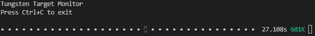

# Tungsten Target

Mock control of tungsten target with visualization

## Setup

1. Install uv with PowerShell: `powershell -ExecutionPolicy ByPass -c "irm https://astral.sh/uv/install.ps1 | iex"`
1. `uv sync`

## Usage

`uv run main.py`

